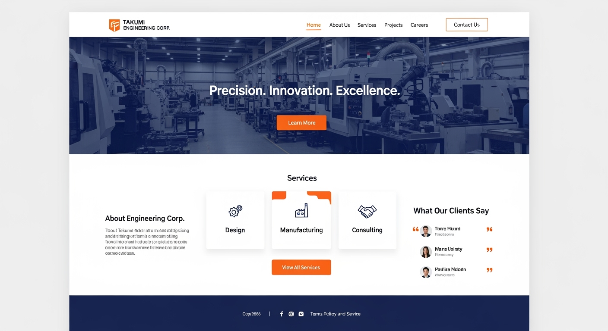

# 匠機エンジニアリング コーポレートサイト要件定義 改修計画書

## 📋 改修の目的
現在の要件定義HTMLファイルは、制作会社向けの開発仕様書的な内容が混在している。エンジニアリング会社のコーポレートサイトとして適切な構成に整理し、実際のサイト構築に適した要件定義書に改修する。

## 🔍 現状分析

### ✅ **残すべき必要なセクション**
1. **プロジェクト概要** - 会社の基本情報として必要
2. **UI/ビジュアル要件** - デザイン方針として重要
3. **会社情報** - コーポレートサイトの核となる情報
4. **サイト設計** - サイト構造の設計情報
5. **ペルソナ設定** - ターゲットユーザーの定義（※ユーザー指摘により残す）
6. **機能要件** - サイトの機能仕様
7. **技術要件** - 実装に必要な技術仕様

### ❌ **削除すべき不要なセクション**
以下は制作会社向けの内部情報であり、実際のコーポレートサイトには不要：

8. **ユーザー要望一覧** - 開発プロセスの管理情報
9. **SEO・アクセシビリティ要件** - 技術的な内部仕様
10. **セキュリティ要件** - インフラ・セキュリティの内部仕様
11. **運用・保守要件** - 運用チーム向けの内部情報
12. **成果測定** - マーケティング・分析の内部KPI
13. **プロジェクト管理** - 制作プロセスの管理情報
14. **納品物** - 制作会社との契約事項

## 🎯 改修後の構成案

### 新しいサイト構成
```
匠機エンジニアリング株式会社 コーポレートサイト
├── 1. 会社概要（プロジェクト概要から名称変更）
├── 2. サービス・技術力（UI/ビジュアル要件から内容変更）
├── 3. 会社情報・沿革
├── 4. 実績・事例（サイト設計から内容変更）
├── 5. ペルソナ・ターゲット（ペルソナ設定）
├── 6. 採用情報（機能要件から内容変更）
└── 7. お問い合わせ（技術要件から内容変更）
```

## 📝 具体的な改修内容

### 🔄 **セクション名・内容の変更**

#### 1. プロジェクト概要 → 会社概要
- **変更理由**: より適切なセクション名
- **内容調整**: 統計カードの内容をサイト制作情報から会社情報に変更
- **統計カード例**: 
  - 創業年数、従業員数、取引実績、ISO認証取得年

#### 2. UI/ビジュアル要件 → サービス・技術力
- **変更理由**: 訪問者向けのサービス紹介に変更
- **内容調整**: 
  - UIデザイン案 → サービス紹介画像
  - カラーパレット → 技術分野・専門領域の視覚化
  - デザインコンセプト → 技術理念・品質方針

#### 3. 会社情報 → 会社情報・沿革
- **変更理由**: より詳細な会社情報として拡充
- **内容追加**: 会社沿革、企業理念、組織図

#### 4. サイト設計 → 実績・事例
- **変更理由**: 顧客向けの実績紹介に変更
- **内容調整**:
  - サイトマップ → 事業分野別実績
  - Mermaid図表 → 実績の分類・業界別表示

#### 5. ペルソナ設定 → ペルソナ・ターゲット
- **変更理由**: より分かりやすいセクション名
- **内容**: そのまま維持（重要な設計情報として）

#### 6. 機能要件 → 採用情報
- **変更理由**: コーポレートサイトに必須の採用情報
- **内容調整**:
  - 業務フロー → 採用プロセス
  - 主要機能 → 募集職種・待遇

#### 7. 技術要件 → お問い合わせ
- **変更理由**: サイトの最終目的であるお問い合わせ
- **内容調整**:
  - システムアーキテクチャ → お問い合わせフォーム
  - 技術スタック → 連絡先情報

## 🖼️ ヒーローヘッダー画像の追加

### 追加内容
- **位置**: メインヘッダー部分
- **画像**: 生成済みのUIデザイン画像を活用
- **効果**: 工場・設計現場の雰囲気を演出
- **実装**: 
  ```html
  <div class="hero-image">
    
  </div>
  ```

## 🎨 デザイン調整

### CSSスタイルの調整
1. **ヒーローセクション**: 画像表示のための新しいスタイル追加
2. **統計カード**: 会社情報に適した配色・アイコン
3. **セクションタイトル**: エンジニアリング会社らしいビジュアル
4. **カード配色**: 製造業・技術系企業の信頼感を表現

## ✅ 改修の優先順位

### Phase 1: 構造改修（高優先度）
1. 不要セクションの削除
2. セクション名の変更
3. ナビゲーション更新

### Phase 2: コンテンツ改修（中優先度）
1. 各セクション内容の調整
2. 統計カード内容の変更
3. Mermaid図表の更新

### Phase 3: デザイン改修（低優先度）
1. ヒーローヘッダー画像の追加
2. CSS調整
3. レスポンシブ対応の確認

## 📅 改修スケジュール目安
- **Phase 1**: 1-2時間
- **Phase 2**: 2-3時間  
- **Phase 3**: 1時間
- **総作業時間**: 4-6時間

## 🔍 改修後の確認項目
- [ ] 不要セクションの完全削除
- [ ] セクション名の適切な変更
- [ ] 内容の整合性チェック
- [ ] ナビゲーション動作確認
- [ ] ヒーローヘッダー画像の表示確認
- [ ] レスポンシブデザインの動作確認
- [ ] Mermaid図表の正常表示

---

**作成日**: 2025年8月25日  
**作成者**: Claude Code  
**対象ファイル**: `匠機エンジニアリング_コーポレートサイト要件定義.html`